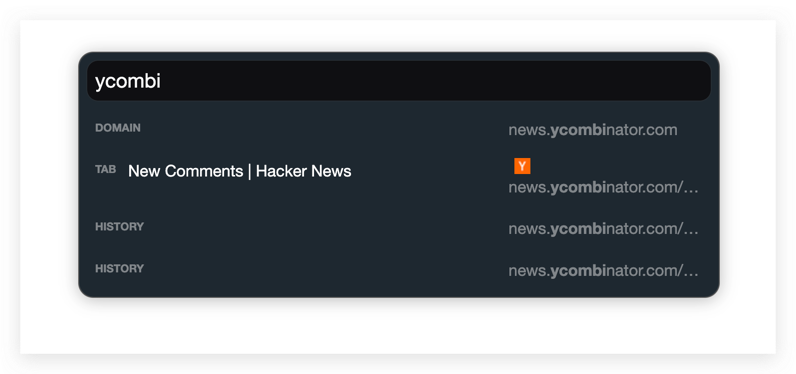
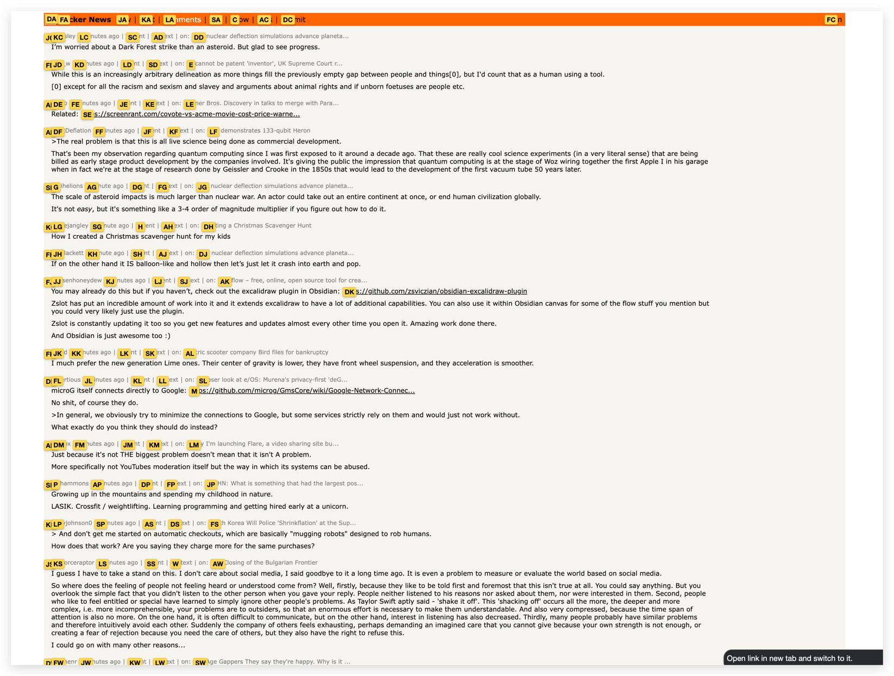

# Vimium Modern Dark

Theme for Vimium extension.

## Installation

Copy the content of the `vimium-modern-dark.css` file and paste it into Vimium's Advanced Options under `CSS for Vimium UI`.

## Screenshots

